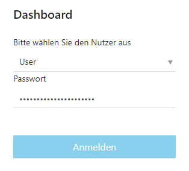
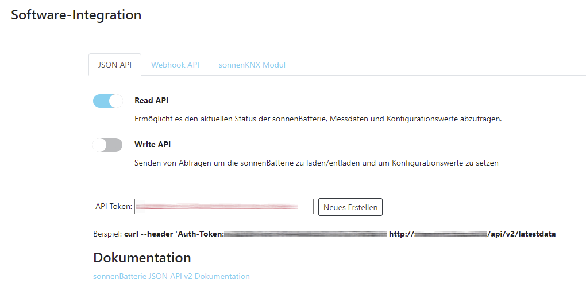

This repository contains libraries that can be used with the sonnen.de photovoltaics system.  

# sonnen-api-client

The sonnen-api-client is a simple pure Java based client
to access the JSON API of a sonnen battery like the sonnenBatterie 10 performance.

    DefaultSonnenClientProperties properties = new DefaultSonnenClientProperties();
    properties.setApiUrl("http://<your_host_or_ip>/api/v2");
    properties.setApiToken("<your_api_token>");

    SonnenClient sonnenClient = new JavaSonnenClient(properties);

    System.out.println("Erzeugung [W]: " + status.getProductionW());
    System.out.println("Verbrauch [W]: " + status.getConsumptionW());
    System.out.println("Einspeisung [W]: " + status.getGridFeedInW());
    System.out.println("Notstromreserve: " + status.getBackupBuffer());

will output something like this:

    Erzeugung [W]: 5864
    Verbrauch [W]: 415
    Einspeisung [W]: 5392
    Notstromreserve: 15

## Enable JSON API

Log into your sonnen battery by typing it's IP address in your browser. 
Select *User* in the login dialog.

The password for the first login is printed on a label at the 
side of your battery and must be changed after the first login.

The JSON API can be enabled in the *Software-Integration* menu.

After you have enabled the **Read API** you can generate a new API TOKEN.

